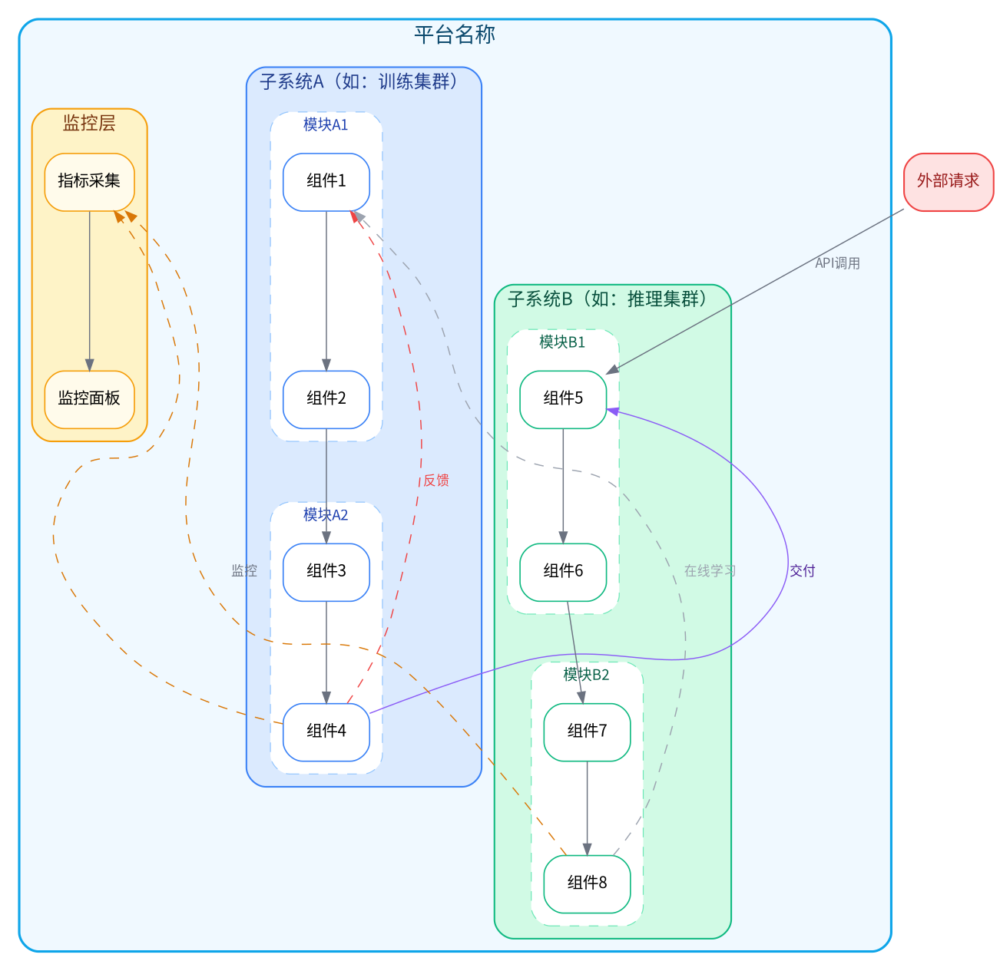

# 多层嵌套布局模板

## 适用场景
AI 平台、云原生系统、复杂多子系统架构、需要表达从属关系和跨子系统反馈的场景。

## 核心布局技术
- `newrank=true` 全局分层，忽略 cluster 边界（跨集群节点能对齐到同一 rank）
- 三层嵌套 `cluster`：大平台 → 子系统 → 子模块
- 横向跨集群连接用 `constraint=false` + `minlen=2`
- 差异化虚线区分不同类型跨区路径

## 完整模板



## 自定义要点

1. **替换层级名称**：`cluster_platform` → 平台名，`cluster_subsys_a/b` → 子系统名，`cluster_mod_x` → 模块名
2. **嵌套深度**：最多三层（平台→子系统→模块），更多层 Graphviz 性能下降
3. **newrank=true**：必须在顶层设置，否则跨集群的 rank=same 不生效
4. **跨区连接防交叉（重要！）**：跨集群的虚线连接容易交叉混乱。遵循以下规则：
   - **所有跨集群边必须用 `constraint=false`**，否则会拉乱分层
   - **跨集群边数量 ≤ 3 条**，超过的用"汇聚节点"模式：多个源 → 1个中间节点 → 多个目标
   - **跨集群边用不同颜色区分类型**：交付（紫粗线）、监控（黄虚线）、反馈（灰虚线）
   - **`minlen=2`** 让跨集群边有足够空间走线
   - 示例（汇聚模式）：
     ```dot
     // 不好的做法：4条跨集群直连，必然交叉
     a1 -> metrics; a2 -> metrics; b1 -> metrics; b2 -> metrics
     
     // 好的做法：先汇聚再分发
     a1 -> hub_a [style=invis]  // 子系统A内部汇聚
     a2 -> hub_a [style=invis]
     hub_a -> metrics [label=" 监控", style=dashed, constraint=false]
     b1 -> hub_b [style=invis]  // 子系统B内部汇聚
     b2 -> hub_b [style=invis]
     hub_b -> metrics [label=" 监控", style=dashed, constraint=false]
     ```
5. **论文尺寸**：嵌套图较复杂，建议 `size="6.8,5!"`（跨双栏）或拆分为多张子图
6. **如果跨集群连接超过 4 条**：考虑拆分为两张图（训练流程图 + 推理流程图），用文字说明关联
