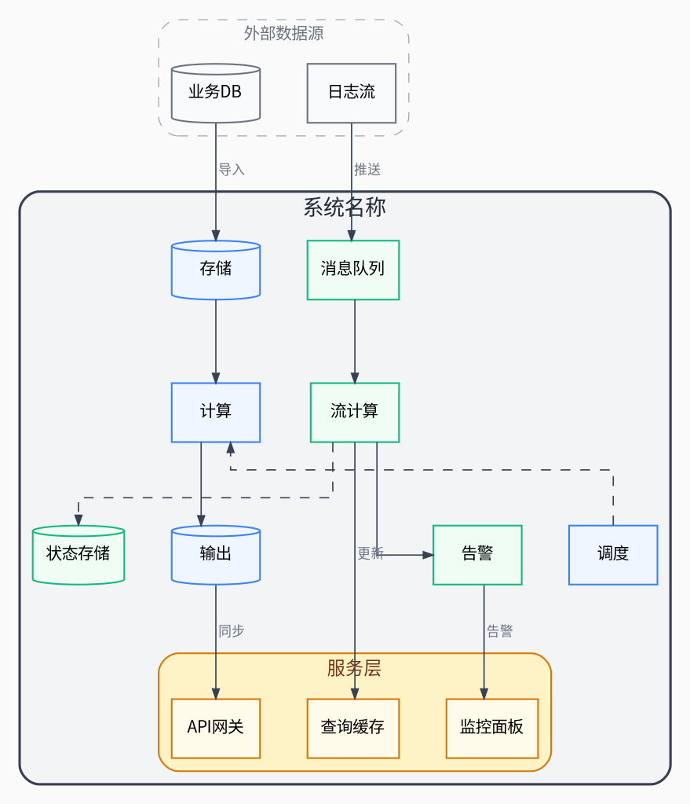

# 正交工程图布局模板

## 适用场景
大数据平台、微服务架构、基础设施拓扑、任何需要严谨工程图风格的架构。

## 核心布局技术
- `splines=ortho` 所有连线 90 度正交（无斜线）
- 两层嵌套 `cluster` 做系统边界 + 子系统分区
- `rank=same` 左右两列对齐
- `shape=cylinder` 表示存储组件

## 完整模板

## 自定义要点

1. **替换分区名**：`cluster_left/right` → 实际子系统名
2. **splines=ortho 限制**：正交模式不支持边标签（label），标签会被忽略。如需标签，改用 `splines=polyline` 或 `splines=true`
3. **存储组件**：用 `shape=cylinder` 表示数据库/存储
4. **嵌套层级**：最多两层 cluster 嵌套，更多层会变复杂
5. **论文尺寸**：正交图通常较宽，建议 `size="7,5!"`（跨双栏）
