# 线性流水线布局模板

## 适用场景
MLOps 生命周期、ETL 管道、CI/CD 流程、数据处理流水线、任何线性顺序的处理链。

## 核心布局技术
- `rankdir=LR` 水平方向
- `weight=100` 主线严格水平直线
- `constraint=false` 反馈线和支线不干扰主层
- `{ rank=same }` 产物层与对应阶段对齐

## 完整模板

```dot
digraph Pipeline {
  rankdir=LR
  ranksep=1.0
  nodesep=0.3
  bgcolor=white
  fontname="Noto Sans CJK SC"
  fontcolor="#1F2937"
  node [fontname="Noto Sans CJK SC", shape=box, style="rounded,filled", penwidth=0.8, fontsize=10]
  edge [fontname="Noto Sans CJK SC", color="#6B7280", fontcolor="#6B7280", penwidth=0.8, arrowsize=0.7, fontsize=8]
  labelloc="t"
  fontsize=14
  fontcolor="#1F2937"

  // ====== 主线节点（从左到右）======
  stage1 [label="阶段一", fillcolor="#FEF3C7", color="#D97706", fontcolor="#78350F"]
  stage2 [label="阶段二", fillcolor="#DBEAFE", color="#3B82F6", fontcolor="#1E3A8A"]
  stage3 [label="阶段三", fillcolor="#D1FAE5", color="#10B981", fontcolor="#064E3B"]
  stage4 [label="阶段四", fillcolor="#FED7AA", color="#EA580C", fontcolor="#7C2D12"]
  stage5 [label="阶段五", fillcolor="#E0E7FF", color="#4F46E5", fontcolor="#312E81"]
  stage6 [label="最终输出", fillcolor="#FEE2E2", color="#B91C1C", fontcolor="#991B1B", penwidth=1.0]

  // ====== 主线连接（weight=100 强制水平）======
  stage1 -> stage2 [weight=100, label=" 产物1"]
  stage2 -> stage3 [weight=100, label=" 产物2"]
  stage3 -> stage4 [weight=100, label=" 产物3"]
  stage4 -> stage5 [weight=100, label=" 产物4"]
  stage5 -> stage6 [weight=100]

  // ====== 上方：反馈闭环 ======
  subgraph cluster_feedback {
    label="反馈闭环"
    style="rounded,dashed"
    color="#9CA3AF"
    fontcolor="#6B7280"
    penwidth=0.5
    fontsize=10
    feedback1 [label="检测节点", fillcolor=white]
    feedback2 [label="触发节点", fillcolor=white]
  }

  stage5 -> feedback1 [style=dashed, color="#9CA3AF", constraint=false]
  feedback1 -> feedback2 [style=dashed, color="#9CA3AF"]
  feedback2 -> stage3 [style=dashed, color="#9CA3AF", label=" 回流", constraint=false, fontcolor="#9CA3AF"]

  // ====== 下方：产物存储 ======
  subgraph cluster_artifacts {
    label="阶段产物"
    style="rounded,dashed"
    color="#9CA3AF"
    fontcolor="#6B7280"
    penwidth=0.5
    fontsize=10
    store1 [label="存储1", shape=cylinder, fillcolor="#F9FAFB", color="#6B7280", fontcolor="#4B5563", fontsize=9]
    store2 [label="存储2", shape=cylinder, fillcolor="#F9FAFB", color="#6B7280", fontcolor="#4B5563", fontsize=9]
  }

  stage2 -> store1 [style=dotted, color="#D1D5DB", constraint=false]
  stage4 -> store2 [style=dotted, color="#D1D5DB", constraint=false]

  // 对齐约束
  { rank=same; stage2; store1 }
  { rank=same; stage4; store2 }
  { rank=same; stage5; feedback1 }
}
```

## 自定义要点

1. **替换阶段名**：`stage1-6` → 用户实际的处理阶段
2. **增减阶段**：按需增减 `stageN`，保持 `weight=100` 主线
3. **反馈闭环**：根据实际有无反馈调整，无则删除 `cluster_feedback`
4. **产物存储**：用 `shape=cylinder` 表示数据库/存储
5. **论文尺寸**：线性流水线通常较宽，建议 `size="7,3!"`（跨双栏）或 `size="3.5,5!"`（单栏竖排，需改 `rankdir=TB`）
