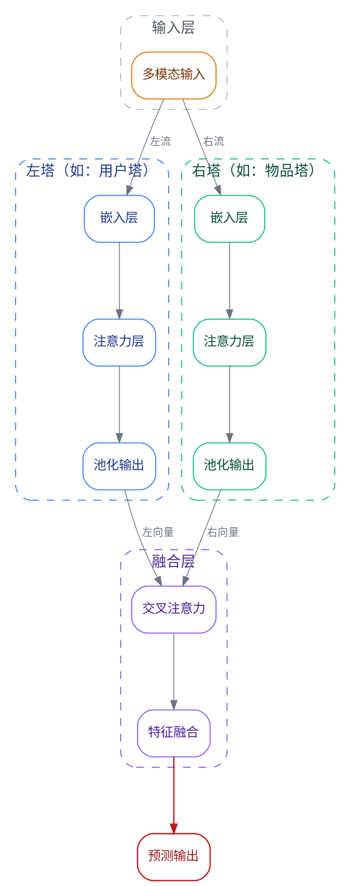

# 对称双塔布局模板

## 适用场景
双塔推荐模型、Encoder-Decoder、对比学习、任何有两条对称并行处理路径的架构。

## 核心布局技术
- `rank=same` 强制左右塔同层对齐
- `group` 属性保持平行流走直线
- `weight=10` 加大塔内部边权重保持垂直紧凑
- `constraint=false` 让残差/反馈线不干扰主分层

## 完整模板

## 自定义要点

1. **替换节点名**：`l1/l2/l3` → 用户实际的模块名（如"用户特征嵌入"/"自注意力"/"池化"）
2. **替换塔标题**：`cluster_left` 的 `label` 改为实际名称（如"编码器"/"解码器"）
3. **增减层数**：如果塔有 4 层，加 `l4` 并对应 `{ rank=same; l4; r4 }`
4. **残差连接**：取消注释残差线，或删除
5. **论文尺寸**：在 `graph []` 中加 `size="3.5,4!"`（单栏）或 `size="7,4!"`（跨栏）
