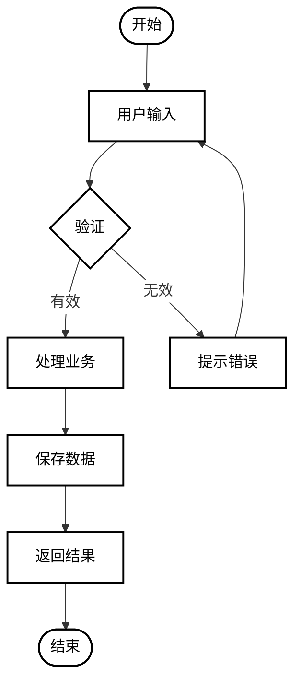
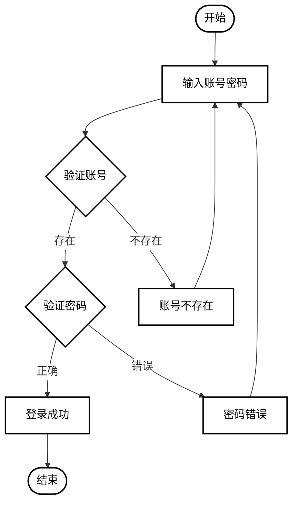
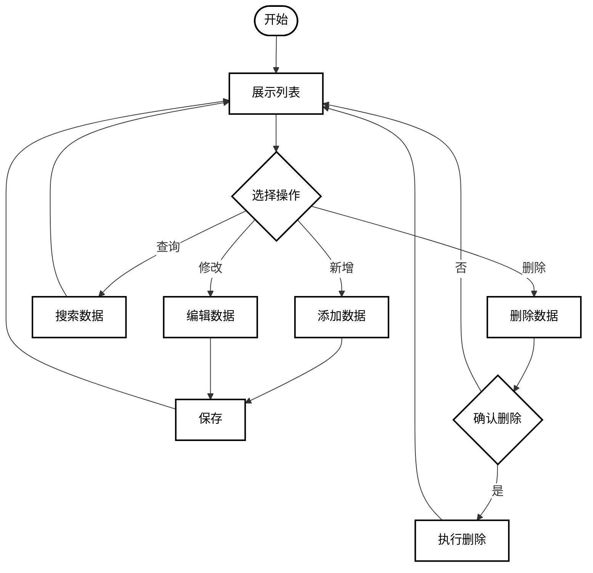
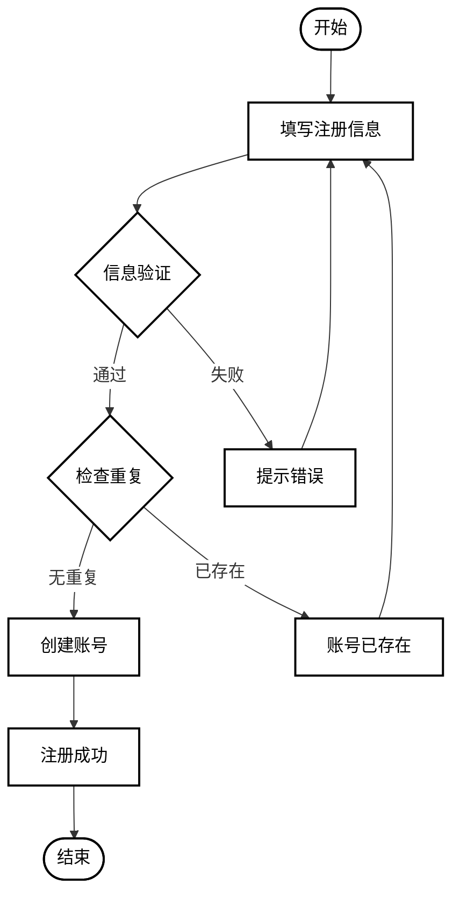

# Mermaid 流程图生成 Skill

## 核心目标

根据用户描述生成**可直接渲染、尽量不报错**的 Mermaid 流程图代码，专用于软件工程系统论文。

## 设计风格

- **背景**：白色
- **节点**：纯白色背景 + 黑色边框
- **复杂度**：适中，有适当分支，不要过于复杂
- **场景**：本科课程设计论文、毕业设计论文

### 白色背景配置（必须）

所有流程图必须包含以下样式定义，确保白色背景和白色节点：

```mermaid
%%{init: {'themeVariables': { 'edgeLabelBackground': '#ffffff'}}}%%
flowchart TD
    %% 定义默认样式：白色背景，黑色边框
    classDef default fill:#ffffff,stroke:#000000,stroke-width:2px,color:#000000
    classDef diamond fill:#ffffff,stroke:#000000,stroke-width:2px,color:#000000
    
    %% 你的流程图节点...
```

**关键样式规则：**
- `fill:#ffffff` - 节点填充纯白色
- `stroke:#000000` - 黑色边框
- `stroke-width:2px` - 边框宽度2像素
- `color:#000000` - 黑色文字
- 菱形判断节点需要额外定义 `diamond` 类并应用

## 输出格式

**只输出一个 Mermaid 代码块**，格式如下：

```mermaid
flowchart TD
    %% 流程图内容
```

**禁止**：
- 代码块前后添加任何解释文字
- 输出多个版本
- 使用 "下面是代码" 之类的说明

## 稳定性优先规则

### 图类型选择
- **默认使用** `flowchart TD`（自上而下流程图）
- 其他可选：`sequenceDiagram`、`classDiagram`、`stateDiagram-v2`
- 不要混用不同图类型的语法

### 节点 ID 规则
- **只能使用**：英文字母、数字、下划线
- **示例**：`start_node`、`step_1`、`user_input`、`check_login`
- **禁止**：空格、中文、连字符 `-`、括号、特殊字符

### 节点显示文本规则
- 文本尽量简短（2-8 个字为佳）
- 中文可以放在显示文本中，但要简洁
- 避免：双引号、反引号、尖括号、多层括号、分号

### 连线规则
- **默认**：`A --> B`
- **带标签**：`A -->|是| B`、`A -->|否| C`
- 不要滥用特殊箭头类型

### 其他稳定性规则
1. 判断节点可用菱形 `{}`，但保持简单
2. 子图 `subgraph` 只有明显必要时才使用
3. 每个节点先定义再引用，避免悬空节点
4. 避免交叉依赖和过多回环
5. 不使用实验性特性

## 降级策略

如果需求复杂，按以下顺序降级：
1. 保留核心节点和主干流程
2. 删除次要说明文字
3. 删除装饰性分组
4. 简化为基础 `flowchart TD`

## 论文流程图常见场景

### 1. 系统总体流程


### 2. 登录流程


### 3. 数据增删改查流程


## 渲染为图片

使用 mermaid-cli 将生成的 Mermaid 代码渲染为 PNG 图片：

```bash
# 安装 mermaid-cli（如未安装）
npm install -g @mermaid-js/mermaid-cli

# 渲染为 PNG（白色背景）
mmdc -i input.mmd -o output.png -b white

# 或指定更高分辨率
mmdc -i input.mmd -o output.png -b white -s 3
```

**关键参数：**
- `-i` 输入的 .mmd 文件路径
- `-o` 输出的图片路径
- `-b white` 设置白色背景（必须）
- `-s` 缩放比例（可选，提高清晰度）

## 自检清单

输出前检查：
- [ ] 图类型唯一且正确
- [ ] 包含白色背景样式定义：`classDef default fill:#ffffff,stroke:#000000,stroke-width:2px,color:#000000`
- [ ] 菱形节点定义样式：`classDef diamond fill:#ffffff,stroke:#000000,stroke-width:2px,color:#000000`
- [ ] 所有菱形节点应用 diamond 类：`class 节点名1,节点名2 diamond`
- [ ] 只有 Mermaid 代码块
- [ ] 节点 ID 无非法字符
- [ ] 无未闭合结构
- [ ] 无解释文字混入
- [ ] 是否可用更保守写法

## 示例对话

**用户**：帮我画一个用户注册的流程图

**输出**：

